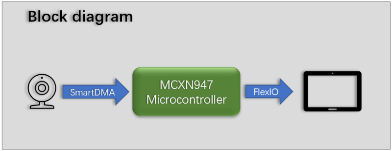
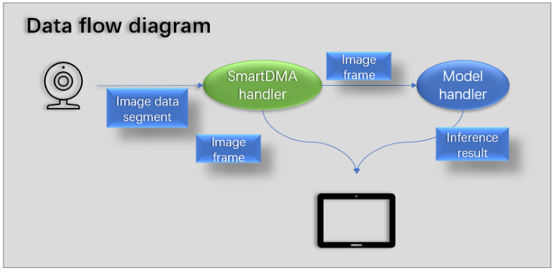
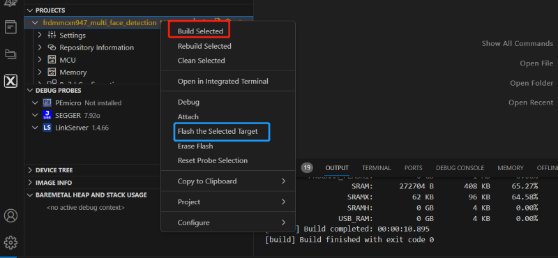
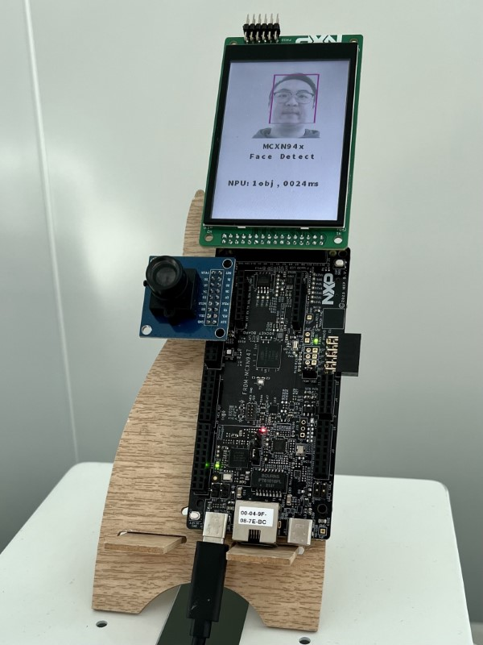

# NXP Application Code Hub

## Multiple Face Detection on MCXN947

Multiple Face detection based on the machine learning algorithm, powered by MCXN947.

The machine learning algorithm is accelerated by the NPU inside.

#### Boards: FRDM-MCXN947

#### Categories: AI/ML

#### Peripherals: PWM, DISPLAY

#### Toolchains: MCUXpresso IDE, VS Code

## Table of Contents

1. [Software](#step1)
2. [Hardware](#step2)
3. [Setup](#step3)
4. [FAQs](#step4)
5. [Support](#step5)
6. [Release Notes](#step6)

## 1. Software 

- Download [SDK_2_16_0_FRDM-MCXN947](https://mcuxpresso.nxp.com/en/welcome)
- Download and install [MCUXpresso IDE V11.9.0 or later](https://www.nxp.com/design/design-center/software/development-software/mcuxpresso-software-and-tools-/mcuxpresso-integrated-development-environment-ide:MCUXpresso-IDE).
- MCUXpresso for Visual Studio Code: This example supports MCUXpresso for Visual Studio Code, for more information about how to use Visual Studio Code please refer [here](https://www.nxp.com/design/training/getting-started-with-mcuxpresso-for-visual-studio-code:TIP-GETTING-STARTED-WITH-MCUXPRESSO-FOR-VS-CODE).

## 2. Hardware 

* 3.5" TFT LCD module by NXP (P/N PAR-LCD-S035)
* Camera module: OV7670
* FRDM-MCXN947 (SCH-90818_REV B) board
* Type-C USB cable

## 3. Setup

### 3.1 Step 1

Rework for camera pins on FRDM-MCXN947 because the camera is not the first function.
Please change SJ16, SJ26, and SJ27 from the A side to the B side.

Board before rework.

Board after rework.

Here is the detail.

Attach the LCD shield (J1: Pins 5-28 skip first 4 pins) to FRDM (J8).
Attach the Camera shield to the FRDM (J9: Pins 5-23; skip first 4 pins), as shown  below:

Connect the debug port on board with the laptop.

### 3.2 Step 2
#### Develop in MCUXpresso IDE

Import project into MCUXpresso, click 'Import project from Application Code Hub', 

search 'multiple face detection on mcxn947' example, clone to local workspace.

Build the project, after compile complete, use the GUI Flash Tool (2 in the following figure) to write the program to the board.

#### Develop in VS code

In VS code, select the 'MCUXpresso For VScode' plugin, and click 'Application Code Hub' in the QUICKSTART PANEL. 
search 'multi-face detection on mcxn947' example, clone to local workspace.

After a while, the project is shown in the 'Projects'.

Build the project, after compile complete flash the board.

### Results

Reset the board, the demo will start detecting the person, if faces are detected, it will draw a rectangle box around the target face, and show the total number of targets, inference during at the bottom.

## 4. FAQs 

*No FAQs have been identified for this project.*

## 5. Support 

*Please contact NXP for additional support.*

#### Project Metadata

<!----- Boards ----->

 

<!----- Categories ----->

<!----- Peripherals ----->

 

<!----- Toolchains ----->

> **Warning**: For more general technical questions regarding NXP Microcontrollers and the difference in expected funcionality, enter your questions on the [NXP Community Forum](https://community.nxp.com/)

## 6. Release Notes 

| Version | Description / Update                    |                                  Date |
| :-----: | --------------------------------------- | ------------------------------------: |
|   1.0   | Initial release on Application Code Hub | January 30th 2024 |

